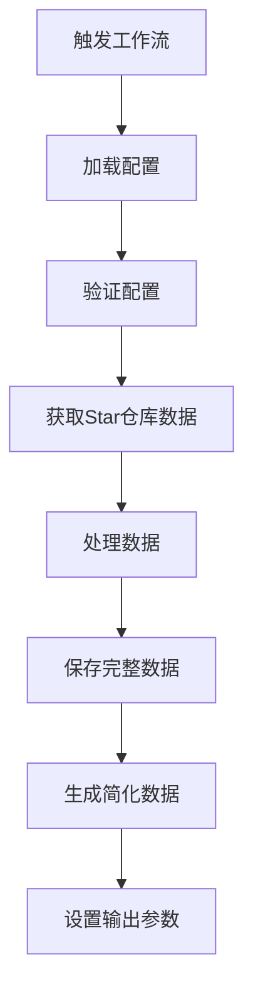

# GitHub Stars Search 项目开发指南

## 1. 项目概述

GitHub Stars Search 是一个自动获取用户 GitHub Star 仓库信息并在网页上展示的工具。它包含两个主要部分：

- **GitHub Action**：定期从 GitHub API 获取用户 Star 的仓库信息
- **前端页面**：用于浏览和搜索这些仓库

## 2. 技术栈

- **后端**: GitHub Actions, Node.js 24, Octokit, GraphQL
- **前端**: React 18, Vite, TypeScript, CSS3, MiniSearch
- **部署**: GitHub Pages
- **包管理**: pnpm

## 3. 项目结构

```
github-stars-search/
├── action/                 # GitHub Action 源码
│   ├── src/
│   │   ├── index.ts       # Action 主要逻辑
│   │   └── modules/       # Action 模块化代码
│   │   └── types/         # TypeScript 类型定义
│   ├── action.yml         # Action 配置
│   └── package.json
├── src/                   # 前端源码
│   ├── App.tsx            # 主要组件
│   ├── types.ts           # 前端类型定义
│   ├── store/             # Jotai 状态管理
│   ├── search.worker.ts   # Web Worker 搜索实现
│   └── ...
├── docs/                  # 构建输出和 GitHub Pages
├── .github/workflows/     # GitHub Actions 工作流
└── scripts/               # 测试和模拟脚本
```

## 4. 核心组件详解

### 4.1 GitHub Action

#### 4.1.1 工作流程



#### 4.1.2 关键模块

- **api.ts**: GraphQL API 集成
- **config.ts**: 配置管理
- **core.ts**: 主处理逻辑
- **rateLimit.ts**: 速率限制处理
- **utils.ts**: 工具函数

#### 4.1.3 配置参数

| 参数 | 描述 | 默认值 |
|------|------|--------|
| `github-token` | GitHub 认证令牌 | `${{ github.token }}` |
| `username` | 要获取 Star 仓库的用户名 | `${{ github.actor }}` |
| `output-file` | 保存完整仓库数据的文件路径 | `./starred-repos.json` |
| `simple-output-file` | 保存简化仓库数据的文件路径 | `./starred-repos-simple.json` |

### 4.2 前端架构

#### 4.2.1 状态管理

使用 Jotai 进行状态管理，关键状态：

- `sortByAtom`: 排序字段
- `sortOrderAtom`: 排序方向
- `showSettingsAtom`: 设置显示状态
- `expandedReposAtom`: 仓库详情展开状态
- `dataUrlAtom`: 数据文件URL

#### 4.2.2 搜索实现

- **Web Worker**: `search.worker.ts` 处理搜索逻辑
- **FlexSearch**: 高性能搜索库
- **搜索流程**:
  1. 初始化 FlexSearch
  2. 构建索引
  3. 执行搜索
  4. 返回结果

#### 4.2.3 数据结构

```typescript
export interface Repository {
  id: number;
  name: string;
  full_name: string;
  html_url: string;
  description: string | null;
  language: string | null;
  languages: Record<string, {
    bytes: number;
    percentage: string;
  }>;
  stargazers_count: number;
  forks_count: number;
  // ...其他字段
}
```

## 5. 开发指南

### 5.1 前端开发

#### 5.1.1 启动开发服务器

```bash
pnpm install
pnpm run dev
```

#### 5.1.2 构建生产版本

```bash
pnpm run build
```

#### 5.1.3 常用开发命令

```bash
# 安装依赖
pnpm install

# 启动开发服务器
pnpm run dev

# 构建生产版本
pnpm run build

# 预览构建结果
pnpm run preview

# 类型检查
pnpm run type-check

# 代码格式化
pnpm run format

# 代码检查
pnpm run lint

# 运行测试
pnpm run test

# 运行GraphQL查询测试
pnpm run test:graphql

# 模拟Action执行
pnpm run simulate:action
```

#### 5.1.4 关键组件开发

- **App.tsx**: 主组件，处理数据加载和状态管理
- **search.worker.ts**: Web Worker 搜索实现
- **store/atoms.ts**: 状态管理
- **App.scss**: 样式定义

### 5.2 Action 开发

#### 5.2.1 Action 开发命令

```bash
# 进入action目录
cd action

# 安装依赖
pnpm install

# 构建Action
pnpm run build
```

#### 5.2.2 关键开发点

- **GraphQL 查询**: 优化查询字段，减少数据量
- **速率限制处理**: 实现指数退避策略
- **错误处理**: 处理各种 API 错误
- **数据处理**: 转换 GitHub API 数据为前端可用格式

## 6. 最佳实践

### 6.1 前端最佳实践

- **状态管理**: 使用 Jotai 进行细粒度状态管理
- **性能优化**:
  - 使用 Web Worker 处理搜索
  - 实现无限滚动加载
  - 按需加载数据
- **响应式设计**: 适配桌面和移动设备

### 6.2 Action 最佳实践

- **速率限制处理**:
  - 实现指数退避策略
  - 监控速率限制头部
  - 递减请求大小
- **错误处理**:
  - 详细记录错误信息
  - 实现重试机制
  - 提供清晰的错误消息
- **数据处理**:
  - 去重处理
  - 数据转换
  - 生成简化版本

## 7. 常见问题

### 7.1 GitHub API 速率限制

- **解决方案**:
  - 实现指数退避重试
  - 递减请求大小
  - 监控速率限制头部

### 7.2 数据同步问题

- **解决方案**:
  - 使用 Web Worker 处理搜索
  - 实现数据缓存
  - 提供手动刷新功能

### 7.3 前端性能问题

- **解决方案**:
  - 实现无限滚动
  - 按需加载数据
  - 优化搜索索引

## 8. 扩展指南

### 8.1 添加新功能

1. 确定功能需求
2. 设计数据结构
3. 实现前端组件
4. 添加状态管理
5. 编写测试

### 8.2 调试技巧

- **前端调试**:
  - 使用 React DevTools
  - 检查 Web Worker 日志
  - 使用浏览器性能分析工具
- **Action 调试**:
  - 使用 `simulate-action.cjs` 脚本
  - 检查 GitHub Actions 日志
  - 添加详细日志输出

## 9. 部署指南

### 9.1 GitHub Pages 部署

1. 构建前端: `pnpm run build`
2. 将构建结果复制到 `docs/` 目录
3. 在仓库设置中启用 GitHub Pages

### 9.2 自定义数据源

- 通过设置浮窗配置自定义数据文件URL
- 支持 JSON 格式的数据文件

本开发指南专为 AI 开发者设计，提供了项目结构、技术栈、核心组件和开发流程的详细说明，帮助 AI 快速理解和开发 GitHub Stars Search 项目。
